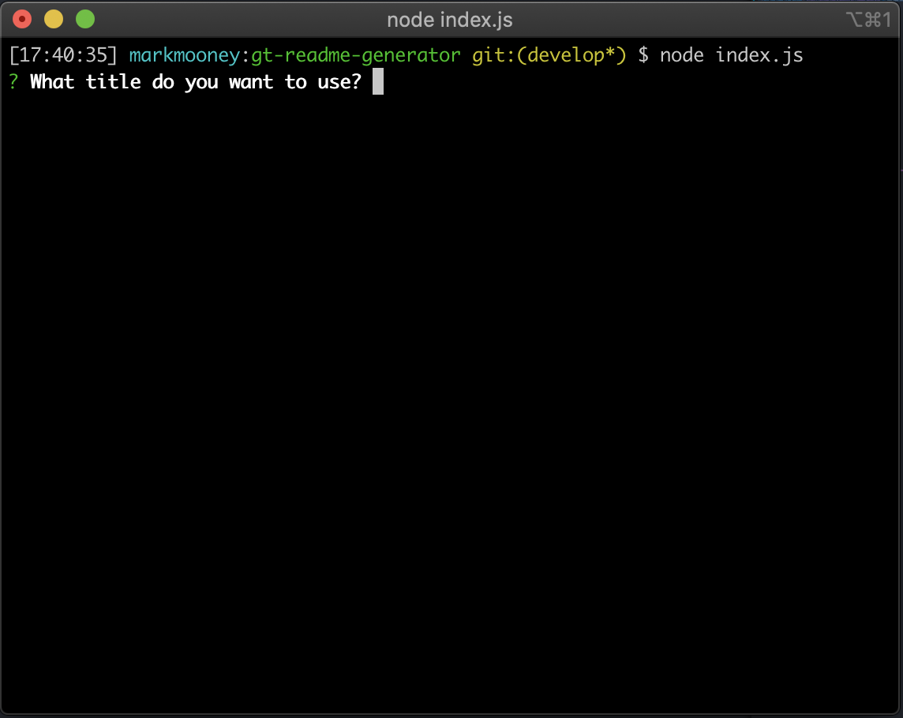
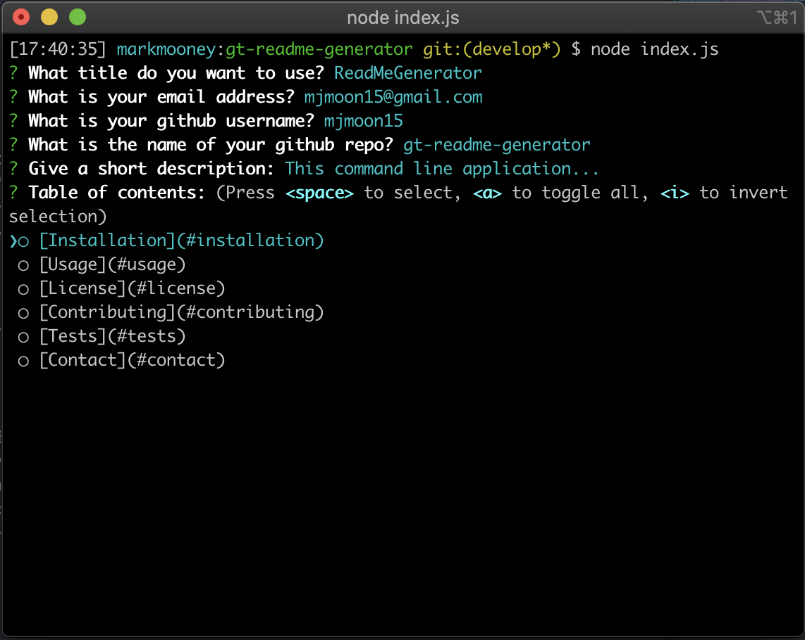
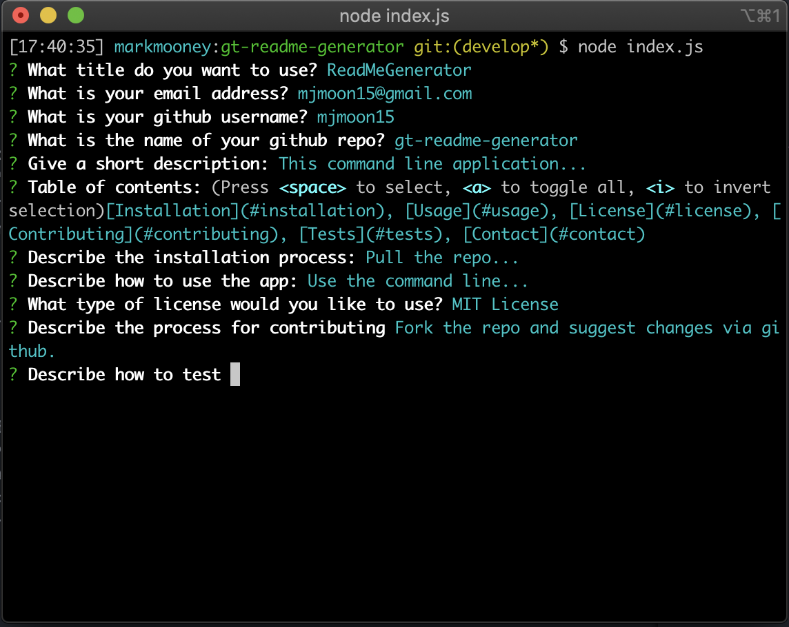

  # ReadMe Generator
  
  
  
  ## Description
  
  This command line application dynamically generates a readme markdown file using inquirer and user input.
  
  ---
  
  ## Table of Contents 

  [Installation](#installation)  
  [Usage](#usage)  
  [License](#license)  
  [Contributing](#contributing)  
  [Tests](#tests)  
  [Contact](#contact)
  
  ---

  ## Installation 

  
  
  [Pull the repo from github]("https://github.com/mjmoon15/gt-readme-generator"). Run npm init and npm install. Open the command line to access the app.
  
  ---

  ## Usage
  
  From the command line, run node index.js and follow prompts. 

  

  

  

  
  ---

  ## MIT License

    Copyright (c) [2020] [Mark J Mooney]

    Permission is hereby granted, free of charge, to any person obtaining a copy
    of this software and associated documentation files (the "Software"), to deal
    in the Software without restriction, including without limitation the rights
    to use, copy, modify, merge, publish, distribute, sublicense, and/or sell
    copies of the Software, and to permit persons to whom the Software is
    furnished to do so, subject to the following conditions:

    The above copyright notice and this permission notice shall be included in all
    copies or substantial portions of the Software.

    THE SOFTWARE IS PROVIDED "AS IS", WITHOUT WARRANTY OF ANY KIND, EXPRESS OR
    IMPLIED, INCLUDING BUT NOT LIMITED TO THE WARRANTIES OF MERCHANTABILITY,
    FITNESS FOR A PARTICULAR PURPOSE AND NONINFRINGEMENT. IN NO EVENT SHALL THE
    AUTHORS OR COPYRIGHT HOLDERS BE LIABLE FOR ANY CLAIM, DAMAGES OR OTHER
    LIABILITY, WHETHER IN AN ACTION OF CONTRACT, TORT OR OTHERWISE, ARISING FROM,
    OUT OF OR IN CONNECTION WITH THE SOFTWARE OR THE USE OR OTHER DEALINGS IN THE
    SOFTWARE.
  
  ---

  ## Contributing
  
  Fork the repo and suggest changes via github.
  
  ---

  ## Tests
  
  Use npm test.
  
  ---

  ## Contact

  [Please check out my github portfolio here.](https://github.com/mjmoon15)
  

  [For further questions, please contact me at mjmoon15@gmail.com.](mailto:mjmoon15@gmail.com) 
  
  ---
  © 2019 Trilogy Education Services, a 2U, Inc. brand. All Rights Reserved.

